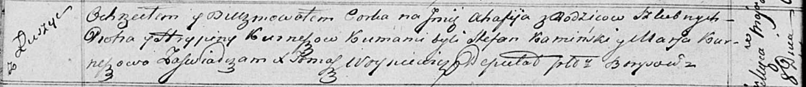

**Курнеш Агафия Петрова (Kurneszowna Ahafija)**

8 мая 1817 г -- крещение (НИАБ 136-13-894, лист 96об, №32/1817-р
(ориг)).

**НИАБ 136-13-894:** Лист 96об. **Метрическая запись №32/1817-р
(ориг).**

Осовская Покровская церковь. 8 мая 1817 года. Метрическая запись о
крещении.

Kurneszowna Ahafija -- дочь родителей с деревни Лустичи.

Kurnesz Piotr -- отец.

Kurneszowa Hrypina -- мать.

Kamiński Stefan -- кум.

Kurneszowa Marja -- кума.

Woyniewicz Tomasz -- ксёндз.
