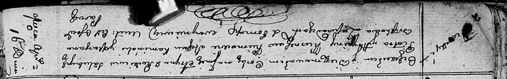

**Курнеш Грыпина (Kurneszowa Hrypina)**

16 апреля 1811 г -- крещение дочери Арыны (НИАБ 136-13-894, лист 80об,
№21/1811-р (ориг)).

8 мая 1817 г -- крещение дочери Агафии (НИАБ 136-13-894, лист 96об,
№32/1817-р (ориг)).

**НИАБ 136-13-894:** Лист 80об. **Метрическая запись №21/1811-р
(ориг).**

Осовская Покровская церковь. 16 апреля 1811 года. Метрическая запись о
крещении.

Kurneszowna Aryna -- дочь родителей с деревни Лустичи.

Kurnesz Piotr -- отец.

Kurneszowa Hrypina -- мать.

Kaminski Stefan -- кум.

Brytkowa Marjana -- кума.

Woyniewicz Tomasz -- ксёндз.

**НИАБ 136-13-894:** Лист 96об. **Метрическая запись №32/1817-р
(ориг).**

Осовская Покровская церковь. 8 мая 1817 года. Метрическая запись о
крещении.

Kurneszowna Ahafija -- дочь родителей с деревни Лустичи.

Kurnesz Piotr -- отец.

Kurneszowa Hrypina -- мать.

Kamiński Stefan -- кум.

Kurneszowa Marja -- кума.

Woyniewicz Tomasz -- ксёндз.
