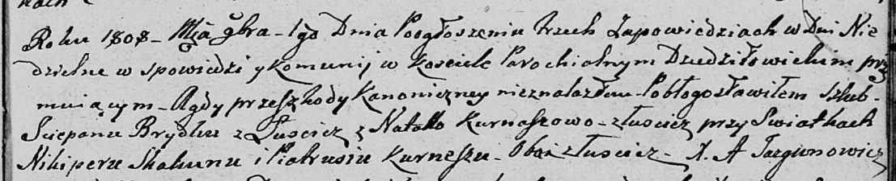
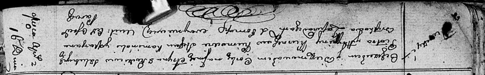
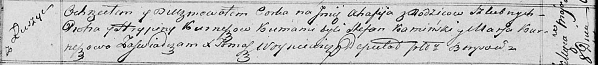

**Курнеш Пётр (Kurnesz Piotr)**

1 ноября 1808 г -- свидетель венчания Степана Брытко с деревни Лустичи с
Натальей Курнеш с деревни Лустичи (НИАБ 136-13-920, лист 14, №8/1808-б
(ориг)).

16 апреля 1811 г -- крещение дочери Арыны (НИАБ 136-13-894, лист 80об,
№21/1811-р (ориг)).

8 мая 1817 г -- крещение дочери Агафии (НИАБ 136-13-894, лист 96об,
№32/1817-р (ориг)).

**НИАБ 136-13-920:** Лист 14. **Метрическая запись №8/1808-б (ориг).**

Дедиловичская Покровская церковь. 1 ноября 1808 года. Метрическая запись
о венчании.

Brytka Sciepan -- жених, с деревни Лустичи.

Kurnaszowa Natalla -- невеста, с деревни Лустичи.

Skakun Nikiper -- свидетель, с деревни Лустичи.

Kurnesz Piatruś -- свидетель, с деревни Лустичи.

Jazgunowicz Antoni -- ксёндз.

**НИАБ 136-13-894:** Лист 80об. **Метрическая запись №21/1811-р
(ориг).**

Осовская Покровская церковь. 16 апреля 1811 года. Метрическая запись о
крещении.

Kurneszowna Aryna -- дочь родителей с деревни Лустичи.

Kurnesz Piotr -- отец.

Kurneszowa Hrypina -- мать.

Kaminski Stefan -- кум.

Brytkowa Marjana -- кума.

Woyniewicz Tomasz -- ксёндз.

**НИАБ 136-13-894:** Лист 96об. **Метрическая запись №32/1817-р
(ориг).**

Осовская Покровская церковь. 8 мая 1817 года. Метрическая запись о
крещении.

Kurneszowna Ahafija -- дочь родителей с деревни Лустичи.

Kurnesz Piotr -- отец.

Kurneszowa Hrypina -- мать.

Kamiński Stefan -- кум.

Kurneszowa Marja -- кума.

Woyniewicz Tomasz -- ксёндз.
