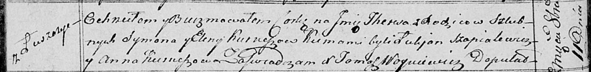

**Курнеш Елена (Kurneszowa Elena)**

11 октября 1814 г -- крещение дочери Тересы (НИАБ 136-13-894, лист 90об,
№58/1814-р (ориг)).

**НИАБ 136-13-894:** Лист 90об. **Метрическая запись №58/1814-р
(ориг).**

Осовская Покровская церковь. 11 октября 1814 года. Метрическая запись о
крещении.

Kurneszowna Theresa -- дочь родителей с деревни Лустичи.

Kurnesz Symon -- отец.

Kurneszowa Elena -- мать.

Szapialewicz Łukjan -- кум.

Kurneszowa Anna -- кума.

Woyniewicz Tomasz -- ксёндз.
