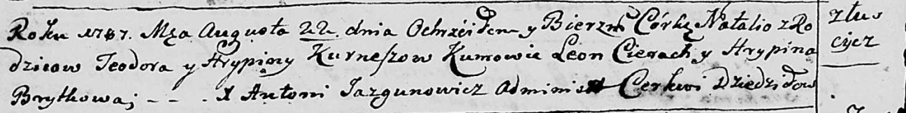
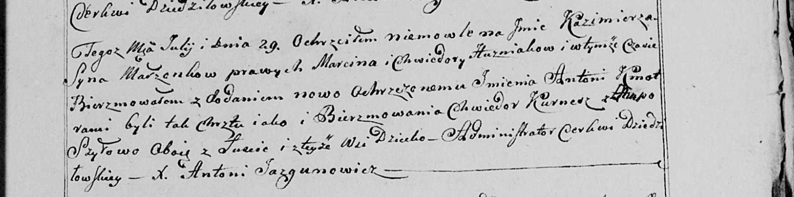

**Курнеш Тодор, Хведор (Kurnesz Teodor, Chwiedor)**

22 августа 1787 г -- крещение дочери Натальи (НИАБ 136-13-894, лист 2об,
№39/1787-р (ориг)).

29 июля 1800 г -- крестный отец Казимира Антона, сына Гузняков Марцина и
Хведоры с деревни Домашковичи (НИАБ 136-13-949, лист 103, №23/1800-р
(коп)).

3 марта 1801 г -- крестный отец Анны Марты, дочери Шапелевичей Хведора и
Агафии с деревни Домашковичи (НИАБ 136-13-894, лист 43, №8/1801-р
(ориг)).

**НИАБ 136-13-894:** Лист 2об. **Метрическая запись №39/1787-р (ориг).**

Дедиловичская Покровская церковь. 22 августа 1787 года. Метрическая
запись о крещении.

Kurneszowna Natalia - дочь родителей с деревни Лустичи.

Kurnesz Teodor -- отец.

Kurneszowa Hrypina -- мать.

Cierach Leon - кум.

Brytkowa Hrypina - кума.

Jazgunowicz Antoniusz -- ксёндз.

**НИАБ 136-13-949:** Лист 103. **Метрическая запись №23/1800-р (коп).**

(См. тж.: РГИА 823-2-18, лист 276об, №20/1800-р (коп), НИАБ 136-13-894,
лист 41об, №21/1800-р (ориг))

Дедиловичская Покровская церковь. 29 июля 1800 года. Метрическая запись
о крещении.

Huzniak Kazimierz Antoni -- сын родителей с деревни Лустичи
\[Домашковичи\].

Huznak Marcin -- отец.

Huzniakowa Chwiedora -- мать.

Kurnesz Chwiedor -- кум, с деревни Лустичи.

Szyłowa Ahapa - кума, с деревни Лустичи.

Jazgunowicz Antoni -- ксёндз.

**НИАБ 136-13-894:** Лист 43. **Метрическая запись №8/1801-р (ориг).**

Дедиловичская Покровская церковь. 3 марта 1801 года. Метрическая запись
о крещении.

Szapialewiczowa Anna Marta -- дочь родителей с деревни Домашковичи.

Szapialewicz Chwiedor -- отец.

Szapialewiczowa Ahapa -- мать.

Kurnesz Chwiedor -- кум, с деревни Лустичи.

Szyłowa Chwiedora -- кума, с деревни Васильковка.

Jazgunowicz Antoni -- ксёндз.
