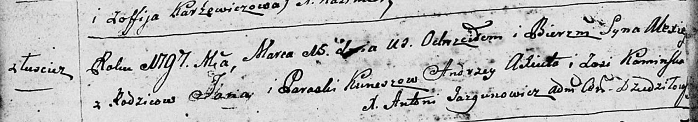
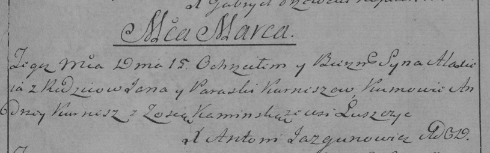

**Курнеш Алексей Янов (Kurnesz Alexiey)**

15 марта 1797 г -- крещение (НИАБ 136-13-894, лист 32об, №16/1797-р
(ориг)), (РГИА 823-2-18, лист 259, №14/1797-р (коп)).

**НИАБ 136-13-894:** Лист 32об. **Метрическая запись №16/1797-р
(ориг).**

Дедиловичская Покровская церковь. 15 марта 1797 года. Метрическая запись
о крещении.

Kurnesz Alexiey -- сын родителей с деревни Лустичи.

Kurnesz Jan -- отец.

Kurneszowa Paraska -- мать.

Axiuto Andrzey - кум.

Kaminska Zosia - кума.

Jazgunowicz Antoni -- ксёндз.

**РГИА 823-2-18:** Лист 259. **Метрическая запись №14/1797-р (коп).**

Дедиловичская Покровская церковь. 15 марта 1797 года. Метрическая запись
о крещении.

Kurnesz Alaxiey -- сын родителей с деревни Лустичи.

Kurnesz Jan -- отец.

Kurneszowa Paraska -- мать.

\[Axiuto\] Andrzey -- кум.

Kaminska Zosia -- кума.

Jazgunowicz Antoni -- ксёндз.
