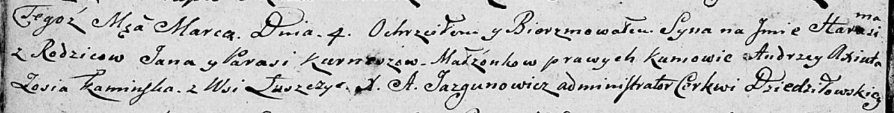

**Курнеш Гарасим Янов (Kurnesz Harasim)**

4 марта 1806 г -- крещение (НИАБ 136-13-894, лист 59об, №10/1806-р
(ориг)).

**НИАБ 136-13-894:** Лист 59об. **Метрическая запись №10/1806-р
(ориг).**

Дедиловичская Покровская церковь. 4 марта 1806 года. Метрическая запись
о крещении.

Kurnesz Harasim -- сын родителей с деревни Лустичи.

Kurnesz Jan -- отец.

Kurneszowa Parasia -- мать.

Axiuta Andrzey -- кум.

Kaminska Zosia -- кума.

Jazgunowicz Antoni -- ксёндз.
