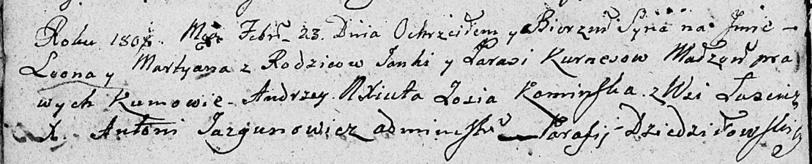

**Курнеш Леон Янов (Kurnesz Leon Martyan)**

23 февраля 1808 г -- крещение (НИАБ 136-13-894, лист 64об, №11/1808-р
(ориг)).

**НИАБ 136-13-894:** Лист 64об. **Метрическая запись №11/1808-р
(ориг).**

{width="6.496527777777778in"
height="1.324919072615923in"}

Дедиловичская Покровская церковь. 23 февраля 1808 года. Метрическая
запись о крещении.

Kurnesz Leon Martyan -- сын родителей с деревни Лустичи.

Kurnesz Janka -- отец.

Kurneszowa Parasia -- мать.

Axiuta Andrzey -- кум.

Kaminska Zosia -- кума.

Jazgunowicz Antoni -- ксёндз.
