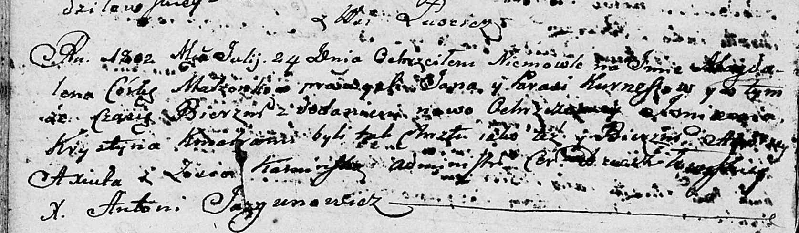

**Курнеш Магдалена Янова (Kurneszowna Magdalena Krystyna)**

24 июля 1802 г -- крещение (НИАБ 136-13-894, лист 47об, №28/1802-р
(ориг)).

**НИАБ 136-13-894:** Лист 47об. **Метрическая запись №28/1802-р
(ориг).**

{width="6.496527777777778in"
height="1.9006944444444445in"}

Дедиловичская Покровская церковь. 24 июля 1802 года. Метрическая запись
о крещении.

Kurneszowna Magdalena Krystyna -- дочь родителей с деревни Лустичи.

Kurnesz Jan -- отец.

Kurneszowa Parasia -- мать.

Axiuta Andrzey -- кум.

Kaminska Zosia -- кума.

Jazgunowicz Antoni -- ксёндз.
