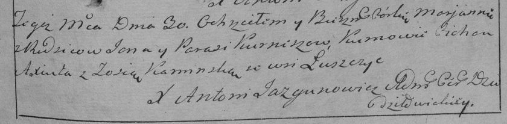

**Курнеш Марьяна Янова (Kurneszowna Marjana)**

30 июля 1790 г -- крещение дочери Марьяны (НИАБ 136-13-894, лист 10об,
№54/1790-р (ориг)), (РГИА 823-2-18, лист 240, №20/1790-р (коп)).

**НИАБ 136-13-894:** Лист 10об. **Метрическая запись №54/1790-р
(ориг).**

{width="6.496527777777778in"
height="0.7020188101487314in"}

Дедиловичская Покровская церковь. 30 июля 1790 года. Метрическая запись
о крещении.

Kurneszowna Marjana -- дочь родителей с деревни Лустичи.

Kurnesz Janka -- отец.

Kurnesz Parasia -- мать.

Axiuta Cichan - кум.

Kaminska Zosia - кума.

Jazgunowicz Antoni -- ксёндз.

**РГИА 823-2-18:** Лист 240. **Метрическая запись №20/1790-р (коп).**

{width="6.496527777777778in"
height="1.5930555555555554in"}

Дедиловичская Покровская церковь. 30 июля 1790 года. Метрическая запись
о крещении.

Kurneszowna Marjanna -- дочь родителей с деревни Лустичи.

Kurnesz Jan -- отец.

Kurneszowa Parasia -- мать.

Axiuta Cichan -- кум.

Kaminska Zosia - кума.

Jazgunowicz Antoni -- ксёндз.
