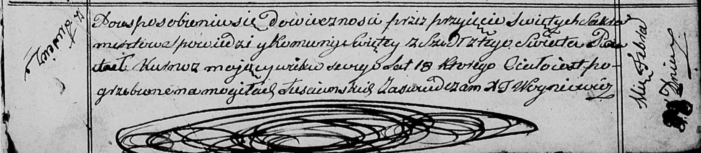

**Курнеш Павел Янов (Kurnesz Paweł)**

22 декабря 1791 г -- крещение (НИАБ 136-13-894, лист 14об, №68/1791-р
(ориг)), (РГИА 823-2-18, лист 243об, №36/1791-р (коп)).

28 февраля 18131 г -- отпевание, умер в возрасте 18 лет (НИАБ
136-13-919, лист 25, №8/1813-у (ориг)).

**НИАБ 136-13-894:** Лист 14об. **Метрическая запись №68/1791-р
(ориг).**

{width="6.496527777777778in"
height="1.015145450568679in"}

Дедиловичская Покровская церковь. 22 декабря 1791 года. Метрическая
запись о крещении.

Kurnesz Paweł -- сын родителей с деревни Лустичи.

Kurnesz Janka -- отец.

Kurneszowa Parasia -- мать.

Axiuta Cichan - кум.

Kaminska Zofija - кума.

Jazgunowicz Antoni -- ксёндз.

**РГИА 823-2-18:** Лист 243об. **Метрическая запись №36/1791-р (коп).**

{width="6.496527777777778in"
height="1.492361111111111in"}

Дедиловичская Покровская церковь. 22 декабря 1791 года. Метрическая
запись о крещении.

Kurnesz Paweł -- сын родителей с деревни Лустичи.

Kurnesz Jan -- отец.

Kurneszowa Parasia -- мать.

Axuita Cichan -- кум.

Kaminska Zofia - кума.

Jazgunowicz Antoni -- ксёндз.

**НИАБ 136-13-919:** Лист 25. **Метрическая запись №8/1813-у (ориг).**

{width="6.496527777777778in"
height="1.4256944444444444in"}

Осовская униатская церковь. 28 февраля 1813 года. Метрическая запись об
отпевании.

Kurnosz Paweł -- умерший, 18 лет, с деревни Лустичи, похоронен на
кладбище деревни Лустичи.

Woyniewicz Tomasz -- ксёндз.
