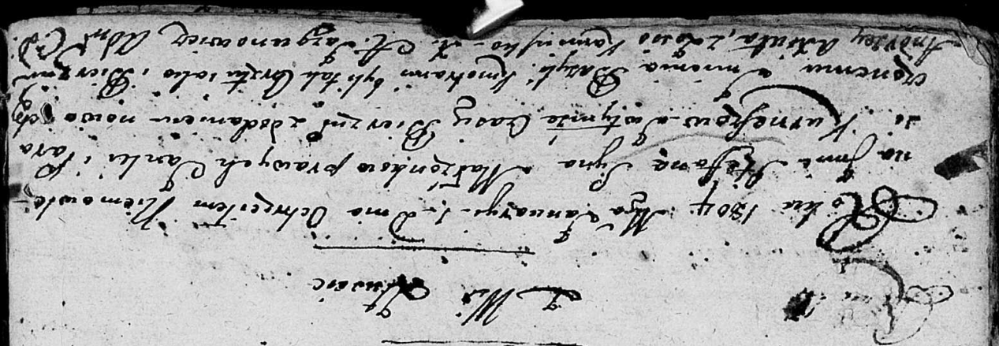

**Курнеш Степан Янов (Kurnesz Stefan Bazyl)**

1 января 1804 г -- крещение (НИАБ 136-13-894, лист 52об, №1/1804-р
(ориг)).

**НИАБ 136-13-894:** Лист 52об. **Метрическая запись №1/1804-р (ориг).**

Дедиловичская Покровская церковь. 1 января 1804 года. Метрическая запись
о крещении.

Kurnesz Stefan Bazyli -- сын родителей с деревни Лустичи.

Kurnesz Janka -- отец.

Kurneszowa Parasia -- мать.

Axiuta Andrzey -- кум.

Kaminska Zosia -- кума.

Jazgunowicz Antoni -- ксёндз.
