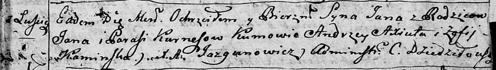
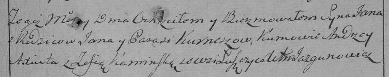

**Курнеш Ян Янов (Kurnesz Jan)**

27 мая 1795 г -- крещение (НИАБ 136-13-894, лист 24, №14/1795-р (ориг)),
(РГИА 823-2-18, лист 252, №11/1795-р (коп)).

**НИАБ 136-13-894:** Лист 24. **Метрическая запись №14/1795-р (ориг).**

Дедиловичская Покровская церковь. 27 мая 1795 года. Метрическая запись о
крещении.

Kurnesz Jan -- сын родителей с деревни Лустичи.

Kurnesz Jan -- отец.

Kurneszowa Parasia -- мать.

Axiuta Andrzey - кум.

Kaminska Zofija - кума.

Jazgunowicz Antoni -- ксёндз.

**РГИА 823-2-18:** Лист 252. **Метрическая запись №11/1795-р (коп).**

Дедиловичская Покровская церковь. 27 мая 1795 года. Метрическая запись о
крещении.

Kurnesz Jan -- сын родителей с деревни Лустичи.

Kurnesz Jan -- отец.

Kurneszowa Parasia -- мать.

Axiuta Andrzey -- кум.

Kaminska Zofia -- кума.

Jazgunowicz Antoni -- ксёндз.
