**Курнеш Ян (Kurnesz Jan, Janka)**

29 июня 1788 г -- крещение сына Петра (НИАБ 136-13-894, лист 4об,
№36/1788-р (ориг)).

30 июля 1790 г -- крещение дочери Марьяны (НИАБ 136-13-894, лист 10об,
№54/1790-р (ориг)), (РГИА 823-2-18, лист 240, №20/1790-р (коп)).

22 декабря 1791 г -- крещение сына Павла (НИАБ 136-13-894, лист 14об,
№68/1791-р (ориг)), (РГИА 823-2-18, лист 243об, №36/1791-р (коп)).

1 ноября 1793 г -- крещение сына Демьяна (НИАБ 136-13-894, лист 20об,
№77/1793-р (ориг)), (РГИА 823-2-18, лист 248об, №43/1793-р (коп)).

27 мая 1795 г -- крещение сына Яна (НИАБ 136-13-894, лист 24, №14/1795-р
(ориг)), (РГИА 823-2-18, лист 252, №11/1795-р (коп)).

15 марта 1797 г -- крещение сына Алексея (НИАБ 136-13-894, лист 32об,
№16/1797-р (ориг)), (РГИА 823-2-18, лист 259, №14/1797-р (коп)).

24 июля 1802 г -- крещение дочери Магдалены Крыстыны (НИАБ 136-13-894,
лист 47об, №28/1802-р (ориг)).

1 января 1804 г -- крещение сына Степана Базыля (НИАБ 136-13-894, лист
52об, №1/1804-р (ориг)).

4 марта 1806 г -- крещение сына Гарасима (НИАБ 136-13-894, лист 59об,
№10/1806-р (ориг)).

23 февраля 1808 г -- крещение сына Леона Мартыана (НИАБ 136-13-894, лист
64об, №11/1808-р (ориг)).

23 марта 1815 г -- отпевание, умер в возраст 69 лет (родился около 1746
г) (НИАБ 136-13-919, лист 28об, №8/1815-у (ориг)).

**НИАБ 136-13-894:** Лист 4-об. **Метрическая запись №36/1788-р
(ориг).**

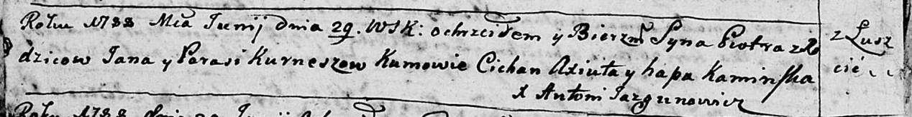

Дедиловичская Покровская церковь. 29 июня 1788 года. Метрическая запись
о крещении.

Kurnesz Piotr -- сын родителей с деревни Лустичи.

Kurnesz Jan -- отец.

Kurneszowa Parasia -- мать.

Axiuta Cichan - кум.

Kaminska Hapa - кума.

Jazgunowicz Antoni -- ксёндз.

**НИАБ 136-13-894:** Лист 10об. **Метрическая запись №54/1790-р
(ориг).**

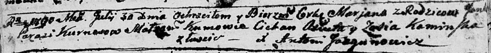

Дедиловичская Покровская церковь. 30 июля 1790 года. Метрическая запись
о крещении.

Kurneszowna Marjana -- дочь родителей с деревни Лустичи.

Kurnesz Janka -- отец.

Kurnesz Parasia -- мать.

Axiuta Cichan - кум.

Kaminska Zosia - кума.

Jazgunowicz Antoni -- ксёндз.

**РГИА 823-2-18:** Лист 240. **Метрическая запись №20/1790-р (коп).**

Дедиловичская Покровская церковь. 30 июля 1790 года. Метрическая запись
о крещении.

Kurneszowna Marjanna -- дочь родителей с деревни Лустичи.

Kurnesz Jan -- отец.

Kurneszowa Parasia -- мать.

Axiuta Cichan -- кум.

Kaminska Zosia - кума.

Jazgunowicz Antoni -- ксёндз.

**НИАБ 136-13-894:** Лист 14-об. **Метрическая запись №68/1791-р
(ориг).**

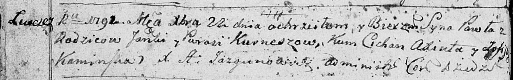

Дедиловичская Покровская церковь. 22 декабря 1791 года. Метрическая
запись о крещении.

Kurnesz Paweł -- сын родителей с деревни Лустичи.

Kurnesz Janka -- отец.

Kurneszowa Parasia -- мать.

Axiuta Cichan - кум.

Kaminska Zofija - кума.

Jazgunowicz Antoni -- ксёндз.

**РГИА 823-2-18:** Лист 243об. **Метрическая запись №36/1791-р (коп).**

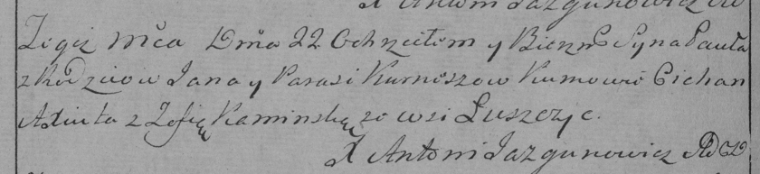

Дедиловичская Покровская церковь. 22 декабря 1791 года. Метрическая
запись о крещении.

Kurnesz Paweł -- сын родителей с деревни Лустичи.

Kurnesz Jan -- отец.

Kurneszowa Parasia -- мать.

Axuita Cichan -- кум.

Kaminska Zofia - кума.

Jazgunowicz Antoni -- ксёндз.

**НИАБ 136-13-894:** Лист 20-об. **Метрическая запись №77/1793-р
(ориг).**

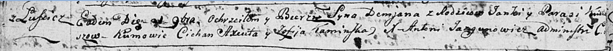

Дедиловичская Покровская церковь. 1 ноября 1793 года. Метрическая запись
о крещении.

Kurnesz Demian -- сын родителей с деревни Лустичи.

Kurnesh Janka -- отец.

Kurneszowa Parasia-- мать.

Axiuta Cichan- кум.

Kaminska Zofija - кума.

Jazgunowicz Antoni -- ксёндз.

**РГИА 823-2-18:** Лист 248об. **Метрическая запись №43/1793-р (коп).**

Дедиловичская Покровская церковь. 1 ноября 1793 года. Метрическая запись
о крещении.

\[Kurnesz\] Demian -- сын родителей с деревни Лустичи.

\[Kurnesz\] Janka -- отец.

\[Kurneszowa\] Parasia -- мать.

Axiuta Cichan -- кум.

Kaminska Zofia -- кума.

Jazgunowicz Antoni -- ксёндз.

**НИАБ 136-13-894:** Лист 24. **Метрическая запись №14/1795-р (ориг).**

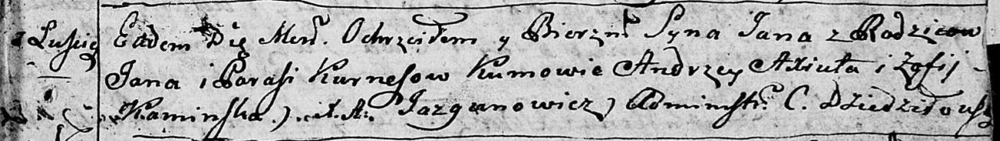

Дедиловичская Покровская церковь. 27 мая 1795 года. Метрическая запись о
крещении.

Kurnesz Jan -- сын родителей с деревни Лустичи.

Kurnesz Jan -- отец.

Kurneszowa Parasia -- мать.

Axiuta Andrzey - кум.

Kaminska Zofija - кума.

Jazgunowicz Antoni -- ксёндз.

**РГИА 823-2-18:** Лист 252. **Метрическая запись №11/1795-р (коп).**

Дедиловичская Покровская церковь. 27 мая 1795 года. Метрическая запись о
крещении.

Kurnesz Jan -- сын родителей с деревни Лустичи.

Kurnesz Jan -- отец.

Kurneszowa Parasia -- мать.

Axiuta Andrzey -- кум.

Kaminska Zofia -- кума.

Jazgunowicz Antoni -- ксёндз.

**НИАБ 136-13-894:** Лист 32об. **Метрическая запись №16/1797-р
(ориг).**

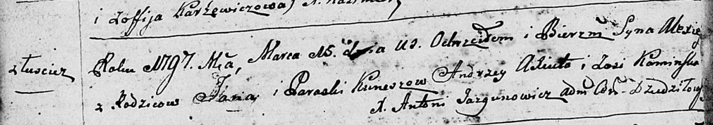

Дедиловичская Покровская церковь. 15 марта 1797 года. Метрическая запись
о крещении.

Kurnesz Alexiey -- сын родителей с деревни Лустичи.

Kurnesz Jan -- отец.

Kurneszowa Paraska -- мать.

Axiuto Andrzey - кум.

Kaminska Zosia - кума.

Jazgunowicz Antoni -- ксёндз.

**РГИА 823-2-18:** Лист 259. **Метрическая запись №14/1797-р (коп).**

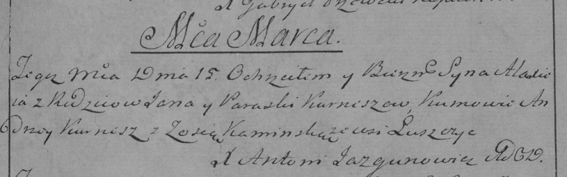

Дедиловичская Покровская церковь. 15 марта 1797 года. Метрическая запись
о крещении.

Kurnesz Alaxiey -- сын родителей с деревни Лустичи.

Kurnesz Jan -- отец.

Kurneszowa Paraska -- мать.

\[Axiuto\] Andrzey -- кум.

Kaminska Zosia -- кума.

Jazgunowicz Antoni -- ксёндз.

**НИАБ 136-13-894:** Лист 47об. **Метрическая запись №28/1802-р
(ориг).**

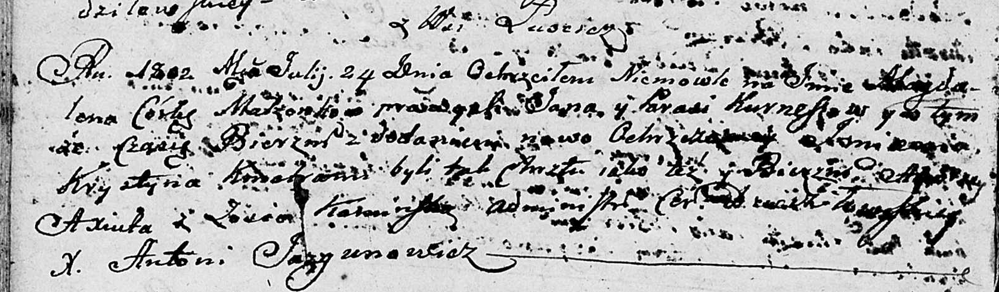

Дедиловичская Покровская церковь. 24 июля 1802 года. Метрическая запись
о крещении.

Kurneszowna Magdalena Krystyna -- дочь родителей с деревни Лустичи.

Kurnesz Jan -- отец.

Kurneszowa Parasia -- мать.

Axiuta Andrzey -- кум.

Kaminska Zosia -- кума.

Jazgunowicz Antoni -- ксёндз.

**НИАБ 136-13-894:** Лист 52об. **Метрическая запись №1/1804-р (ориг).**

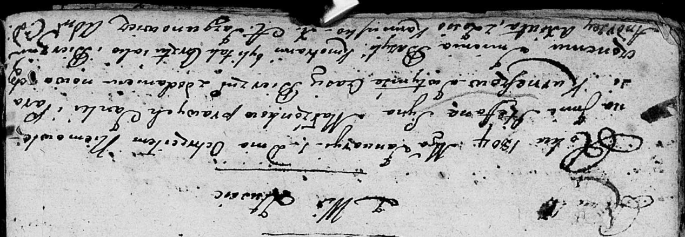

Дедиловичская Покровская церковь. 1 января 1804 года. Метрическая запись
о крещении.

Kurnesz Stefan Bazyli -- сын родителей с деревни Лустичи.

Kurnesz Janka -- отец.

Kurneszowa Parasia -- мать.

Axiuta Andrzey -- кум.

Kaminska Zosia -- кума.

Jazgunowicz Antoni -- ксёндз.

**НИАБ 136-13-894:** Лист 59об. **Метрическая запись №10/1806-р
(ориг).**

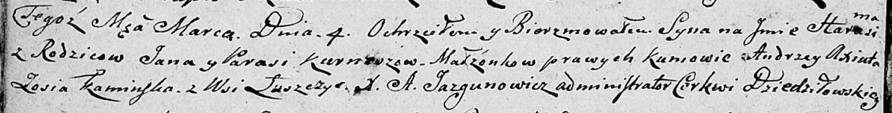

Дедиловичская Покровская церковь. 4 марта 1806 года. Метрическая запись
о крещении.

Kurnesz Harasim -- сын родителей с деревни Лустичи.

Kurnesz Jan -- отец.

Kurneszowa Parasia -- мать.

Axiuta Andrzey -- кум.

Kaminska Zosia -- кума.

Jazgunowicz Antoni -- ксёндз.

**НИАБ 136-13-894:** Лист 64об. **Метрическая запись №11/1808-р
(ориг).**

Дедиловичская Покровская церковь. 23 февраля 1808 года. Метрическая
запись о крещении.

Kurnesz Leon Martyan -- сын родителей с деревни Лустичи.

Kurnesz Janka -- отец.

Kurneszowa Parasia -- мать.

Axiuta Andrzey -- кум.

Kaminska Zosia -- кума.

Jazgunowicz Antoni -- ксёндз.

**НИАБ 136-13-919:** Лист 28об. **Метрическая запись №8/1815-у (ориг).**

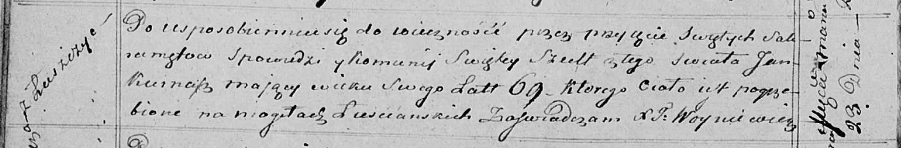

Осовская униатская церковь. 23 марта 1815 года. Метрическая запись об
отпевании.

Kurnasz Jan -- умерший, 69 лет, с деревни Лустичи, похоронен на кладбище
деревни Лустичи.

Woyniewicz Tomasz -- ксёндз.
