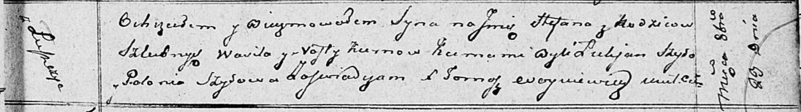

**Курна Степан Василев (Kurna Stefan)**

23 октября 1811 г -- крещение (НИАБ 136-13-894, лист 82, №52/1811-р
(ориг)).

**НИАБ 136-13-894:** Лист 82. **Метрическая запись №52/1811-р (ориг).**

Осовская Покровская церковь. 23 октября 1811 года. Метрическая запись о
крещении.

Kurna? Stefan -- сын родителей с деревни Лустичи.

Kurna? Wasil -- отец.

Kurnowa? Nasta -- мать.

Szyło Łukjan -- кум.

Szyłowa Połonia -- кума.

Woyniewicz Tomasz -- ксёндз.
