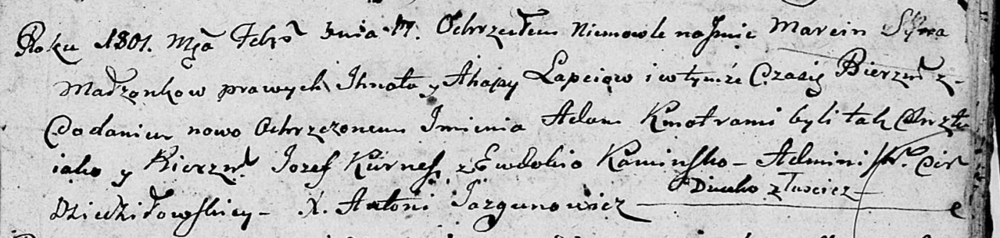

**Лапец Агапа (Łapciowa Ahapa)**

11 февраля 1801 г -- крещение сына Марцина Адама (НИАБ 136-13-894, лист
43, №7/1801-р (ориг)).

**НИАБ 136-13-894:** Лист 43. **Метрическая запись №7/1801-р (ориг).**

Дедиловичская Покровская церковь. 11 февраля 1801 года. Метрическая
запись о крещении.

Łapać Marcin Adam -- сын родителей с деревни Лустичи.

Łapać Jhnat -- отец.

Łapciowa Ahapa -- мать.

Kurnesz Jozef -- кум.

Kaminska Ewdokija -- кума.

Jazgunowicz Antoni -- ксёндз.
