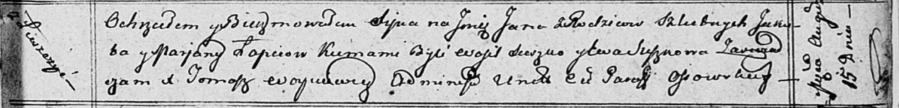

**Лапец Марьяна (Łapciowa Marjana)**

15 августа 1812 г -- крещение сына Яна (НИАБ 136-13-894, лист 85,
№41/1812-р (ориг)).

**НИАБ 136-13-894:** Лист 85. **Метрическая запись №41/1812-р (ориг).**

{width="6.496527777777778in"
height="0.7885148731408574in"}

Осовская Покровская церковь. 15 августа 1812 года. Метрическая запись о
крещении.

Łapieć Jan -- сын родителей с деревни Лустичи.

Łapieć Jakob -- отец.

Łapciowa Marjana -- мать.

Suszko Wasil -- кум.

Suszkowna Ewa -- кума.

Woyniewicz Tomasz -- ксёндз.
