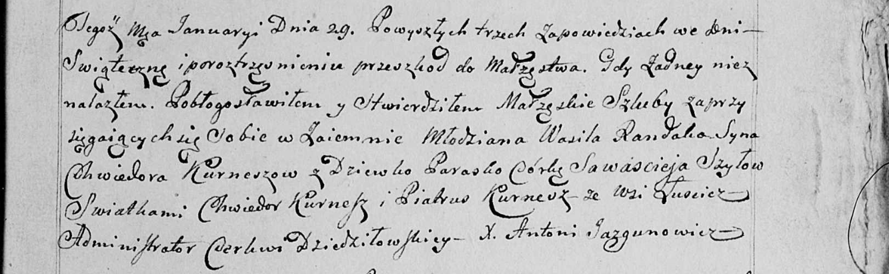

**Рандак Василь Хведоров (Randak Wasil, syn Cwiedora Kurnesza)**

29 января 1800 г -- венчание с девкой Шило Параской Савастеевой (НИАБ
136-13-949, лист 107, №2/1800-б (коп)).

**НИАБ 136-13-949:** Лист 107. **Метрическая запись №2/1800-б (коп).**

(См. тж.: НИАБ 136-13-920, лист 6об, №2/1800-б (ориг))

Дедиловичская Покровская церковь. 29 января 1800 года. Метрическая
запись о венчании.

Randak Wasil, syn Kurnesza Chwiedora -- жених, молодой, с деревни
Лустичи.

Szyłowa Paraska, córka Sawascieja -- невеста, девка.

Kurnesz Chwiedor -- свидетель.

Kurnesz Piatruś -- свидетель.

Jazgunowicz Antoni -- ксёндз.
