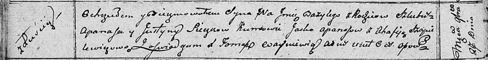

**Сечко Юстына (Sieczkowa Justyna)**

27 ноября 1810 г -- крещение сына Базылия (НИАБ 136-13-894, лист 79об,
№61/1810-р (ориг)).

**НИАБ 136-13-894:** Лист 79об. **Метрическая запись №61/1810-р
(ориг).**

{width="6.496527777777778in"
height="0.8072889326334208in"}

Осовская Покровская церковь. 27 ноября 1810 года. Метрическая запись о
крещении.

Sieczko Bazyli -- сын родителей с деревни Лустичи.

Sieczko Apanas -- отец.

Sieczkowa Justyna -- мать.

Apanasow Jaśka -- кум.

Szapielewiczowa Ahafija -- кума.

Woyniewicz Tomasz -- ксёндз.
