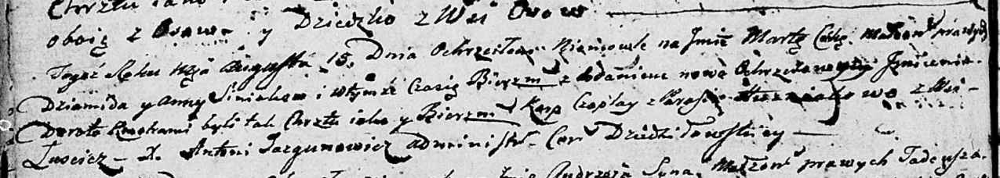

**Синяк Анна (Siniakowa Anna)**

15 августа 1804 г -- крещение дочери Марты Дороты (НИАБ 136-13-894, лист
54об, №31/1804-р (ориг)).

**НИАБ 136-13-894:** Лист 54об. **Метрическая запись №31/1804-р
(ориг).**

Дедиловичская Покровская церковь. 15 августа 1804 года. Метрическая
запись о крещении.

Siniakowna Marta Dorota -- дочь родителей с деревни Лустичи.

Siniak Dziamid -- отец.

Siniakowa Anna -- мать.

Czaplay Karp -- кум.

Huzniakowa Parasia -- кума.

Jazgunowicz Antoni -- ксёндз.
