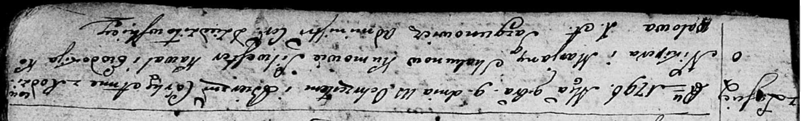

**Скакун Анна Никиперова (Skakunowna Anna)**

9 ноября 1796 г -- крещение (НИАБ 136-13-894, лист 31, №95/1796-р
(ориг)).

**НИАБ 136-13-894:** Лист 31. **Метрическая запись №95/1796-р (ориг).**

{width="6.496527777777778in"
height="0.988996062992126in"}

Дедиловичская Покровская церковь. 9 ноября 1796 года. Метрическая запись
о крещении.

Skakunowna Anna -- дочь родителей с деревни Лустичи.

Skakun Nikiper -- отец.

Skakunowa Marjana -- мать.

Kawal Silwester-- кум.

Kowalowa Ewdokija - кума.

Jazgunowicz Antoni -- ксёндз.
