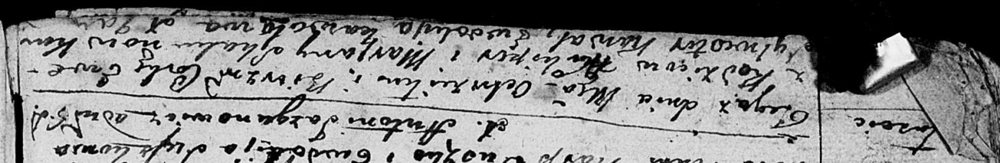
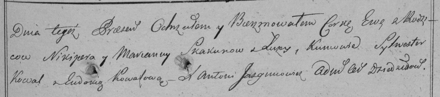

**Скакун Ева Никиперова (Skakunowna Ewa)**

26 декабря 1798 г -- крещение дочери Евы (НИАБ 136-13-894, лист 37об,
№63/1798-р (ориг)), (РГИА 823-2-18, лист 267, №64/1798-р (коп)).

**НИАБ 136-13-894:** Лист 37об. **Метрическая запись №63/1798-р
(ориг).**

Дедиловичская Покровская церковь. 26 декабря 1798 года. Метрическая
запись о крещении.

Skakunowna Ewa -- дочь родителей с деревни Лустичи.

Skakun \[Nikiper\] -- отец.

Skakunowa Marjana -- мать.

Kawal Sylwester - кум.

Kowalowa Ewdokija - кума.

Jazgunowicz Antoni -- ксёндз.

**РГИА 823-2-18:** Лист 267. **Метрическая запись №64/1798-р (коп).**

Дедиловичская Покровская церковь. 26 декабря 1798 года. Метрическая
запись о крещении.

Skakunowna Ewa -- дочь родителей с деревни \[Лустичи\].

Skakun Nikiper -- отец.

Skakunowa Marianna -- мать.

Kowal Sylwester -- кум.

Kowalowa Eudokia -- кума.

Jazgunowicz Antoni -- ксёндз.
