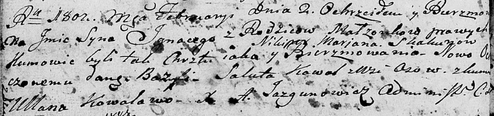

**Скакун Игнацы Никиперов (Skakun Jgnacy Bazyli)**

2 февраля 1802 г -- крещение (НИАБ 136-13-894, лист 45об, №4/1802-р
(ориг)).

**НИАБ 136-13-894:** Лист 45об. **Метрическая запись №4/1802-р (ориг).**

Дедиловичская Покровская церковь. 2 февраля 1802 года. Метрическая
запись о крещении.

Skakun Jgnacy Bazyli -- сын родителей \[с деревни Лустичи\].

Skakun Nikiper -- отец.

Skakunowa Marjana -- мать.

Kawal Saluta -- кум, с деревни Осовo.

Kowalowa Ullana -- кума.

Jazgunowicz Antoni -- ксёндз.
