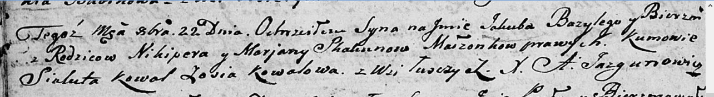

**Скакун Якуб Никиперов (Skakun Jakub Bazyli)**

22 октября 1805 г -- крещение (НИАБ 136-13-894, лист 58, №49/1805-р
(ориг)).

**НИАБ 136-13-894:** Лист 58. **Метрическая запись №49/1805-р (ориг).**

{width="6.496527777777778in"
height="0.890430883639545in"}

Дедиловичская Покровская церковь. 22 октября 1805 года. Метрическая
запись о крещении.

Skakun Jakub Bazyli -- сын родителей с деревни Лустичи.

Skakun Nikiper -- отец.

Skakunowa Marjana -- мать.

Kowal Sialuta -- кум.

Kowalowa Zosia -- кума.

Jazgunowicz Antoni -- ксёндз.
