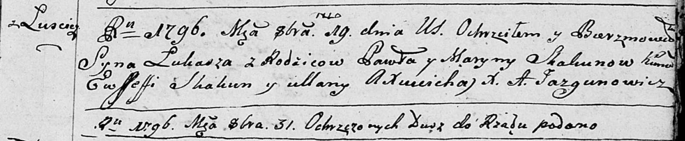
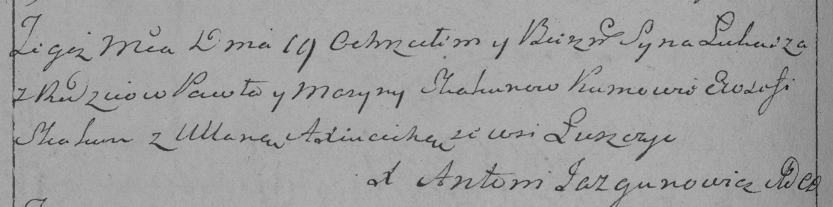

**Скакун Лука Павлов (Skakun Łukasz)**

19 октября 1796 г -- крещение (НИАБ 136-13-894, лист 31, №89/1796-р
(ориг)), (РГИА 823-2-18, лист 257об, №52/1796-р (коп)).

**НИАБ 136-13-894:** Лист 31. **Метрическая запись №89/1796-р (ориг).**

Дедиловичская Покровская церковь. 19 октября 1796 года. Метрическая
запись о крещении.

Skakun Łukasz -- сын родителей с деревни Лустичи.

Skakun Paweł -- отец.

Skakunowa Maryna -- мать.

Skakun Ewsseffi -- кум.

Axiucicha Ullana - кума.

Jazgunowicz Antoni -- ксёндз.

**РГИА 823-2-18:** Лист 257об. **Метрическая запись №52/1796-р (коп).**

Дедиловичская Покровская церковь. 19 октября 1796 года. Метрическая
запись о крещении.

Skakun Łukasz -- сын родителей с деревни Лустичи.

Skakun Paweł -- отец.

Skakunowa Maryna -- мать.

Skakun Ewsefi -- кум.

Axiucicha Ullana -- кума.

Jazgunowicz Antoni -- ксёндз.
