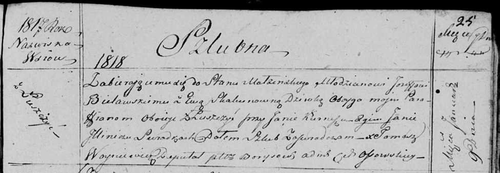

**Белявская (в девичестве Скакун) Ева (Bielawska Ewa z Skakunow)**

9 января 1818 г -- венчание с молодым Иосифом Белявским с деревни
Лустичи (НИАБ 136-13-920, лист 25, №1/1818-б (ориг)).

**НИАБ 136-13-920:** Лист 25. **Метрическая запись №1/1818-б (ориг).**

Осовская Покровская церковь. 9 января 1818 года. Запись о венчании.

Bielawski Jozef -- жених, молодой, парафии Осовской, с деревни Лустичи.

Skakunowna Ewa -- невеста, девка, парафии Осовской, с деревни Лустичи.

Kurnesz Jan -- свидетель.

Jllinicz Jan -- свидетель.

Woyniewicz Tomasz -- ксёндз.
