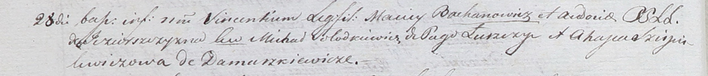

**Солодкевич Михал (Sołodkiewicz Michał)**

28 июля 1801 г -- крестный отец Винцентия, сына Мацея и Евдокии
Бахановичей с деревни Озерщизна (НИАБ 937-4-32, лист 4об, №14/1801-р).

**НИАБ 937-4-32:** Лист 4об. **Метрическая запись №14/1801-р.**

Дедиловичский костел Наисвятейшего Сердца Иисуса. 28 июля 1801 года.
Метрическая запись о крещении.

Bachanowicz Vincenti -- сын родителей с деревни Озерщизна.

Bachanowicz Maciey -- отец.

Bachanowiczowa Audocia -- мать.

Sołodkiewicz Michał -- крестный отец, с деревни Лустичи.

Szapielewiczowa Ahapa -- крестная мать, с деревни Домашковичи.

Linhart Hyacinthus -- ксёндз.
