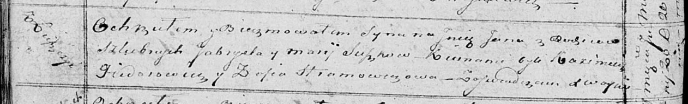

**Сушко Гаврыла (Szuszko Gabriel)**

10 ноября 1810 г -- венчание с девкой Марыей Брытко с деревни Лустичи
(НИАБ 136-13-920, лист 17, №9/1810-б (ориг)).

12 ноября 1811 г -- крещение дочери Елисаветы (НИАБ 136-13-894, лист 82,
№56/1811-р (ориг)).

20 июня 1815 г -- крещение сына Яна (НИАБ 136-13-894, лист 92об,
№32/1815-р (ориг)).

**НИАБ 136-13-920:** Лист 17. **Метрическая запись №9/1810-б (ориг).**

{width="6.496527777777778in"
height="1.3316240157480315in"}

Осовская Покровская церковь. 10 ноября 1810 года. Метрическая запись о
венчании.

Szuszko Gabriel -- жених, молодой, парафии Осовской, с деревни
Замосточье.

Brytkowna Marya -- невеста, девка, парафии Осовской, с деревни Лустичи.
Семья в деревне Лустичи.

Audziuchowicz Łukjan -- свидетель.

Brytka Dziemian -- свидетель.

Woyniewicz Tomasz -- ксёндз.

**НИАБ 136-13-894:** Лист 82. **Метрическая запись №56/1811-р (ориг).**

{width="6.496527777777778in"
height="0.8093000874890639in"}

Осовская Покровская церковь. 12 ноября 1811 года. Метрическая запись о
крещении.

Szuszkowna Elżbieta -- дочь родителей с деревни Лустичи.

Szuszko Gabriel -- отец.

Szuszkowa Marija -- мать.

Fiedorowicz Kazimierz, JP -- кум, шляхтич.

Hramowiczowa Zofia -- кума.

Woyniewicz Tomasz -- ксёндз.

**НИАБ 136-13-894:** Лист 92об. **Метрическая запись №32/1815-р
(ориг).**

{width="6.496527777777778in"
height="0.9936887576552931in"}

Осовская Покровская церковь. 20 июня 1815 года. Метрическая запись о
крещении.

Suszko Jan -- сын родителей с деревни Лустичи.

Suszko Gabryel -- отец.

Suszkowa Marija -- мать.

Fiedorowicz Kazimierz -- кум.

Hramowiczowa Zofia -- кума.

Woyniewicz Tomasz -- ксёндз.
