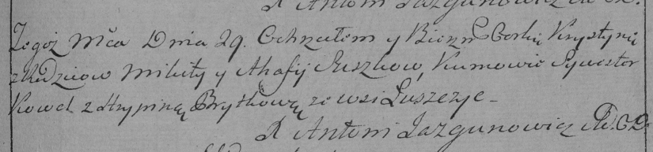

**Сушко Хрыстына Микитова (Suszkowna Krystyna)**

29 июня 1791 г -- крещение дочери Хрыстыны (НИАБ 136-13-894, лист 13,
№26/1791-р (ориг)), (РГИА 823-2-18, лист 242, №13/1791-р (коп)).

**НИАБ 136-13-894:** Лист 13. **Метрическая запись №26/1791-р (ориг).**

{width="6.496527777777778in"
height="0.5947386264216973in"}

Дедиловичская Покровская церковь. 29 июня 1791 года. Метрическая запись
о крещении.

Suszkowna Krystyna -- дочь родителей с деревни Лустичи.

Suszko Mikita -- отец.

Suszkowa Ahafia -- мать.

Kowal Silvester -- кум.

Brytkowa Rypina - кума.

Jazgunowicz Antoni -- ксёндз.

**РГИА 823-2-18:** Лист 242. **Метрическая запись №13/1791-р (коп).**

{width="6.496527777777778in"
height="1.520138888888889in"}

Дедиловичская Покровская церковь. 29 июня 1791 года. Метрическая запись
о крещении.

Suszkowna Krystyna -- дочь родителей с деревни Лустичи.

Suszko Mikita -- отец.

Suszkowa Ahafija -- мать.

Kowal Sylwester -- кум.

Brytkowa Hrypina - кума.

Jazgunowicz Antoni -- ксёндз.
