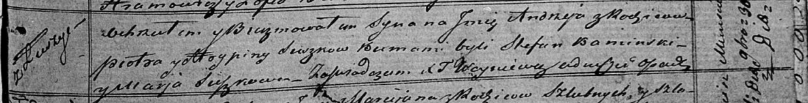

**Сушко Андрей Петров (Suszko Andrzey)**

30 ноября 1819 г -- крещение (НИАБ 136-13-894, лист 103, №61/1819-р
(ориг)).

**НИАБ 136-13-894:** Лист 103. **Метрическая запись №61/1819-р (ориг).**

{width="6.496527777777778in"
height="0.8347790901137357in"}

Осовская Покровская церковь. 30 ноября 1819 года. Метрическая запись о
крещении.

Suszko Andrzey -- сын родителей с деревни Лустичи.

Suszko Piotr -- отец.

Suszkowa Hrypina -- мать.

Kaminski Stefan -- кум.

Suszkowa Marja -- кума.

Woyniewicz Tomasz -- ксёндз.
