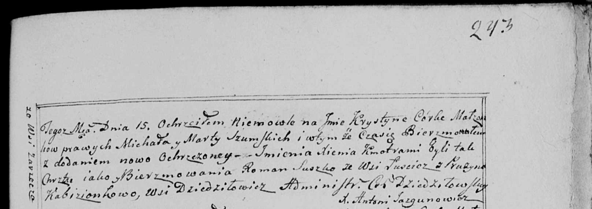

**Сушко Роман (Suszko Roman)**

16 июля 1799 г -- крестный отец Крыстыны Ксени, дочери Шумских Михала и
Марты с деревни Заречье (НИАБ 136-13-938, лист 243, №29/1799-р (коп)).

**НИАБ 136-13-938:** Лист 243. **Метрическая запись №29/1799-р (коп).**

(См. тж. НИАБ 136-13-894, лист 39, №31/1799-р (ориг); РГИА 823-2-18,
лист 271, №30/1799-р (коп))

{width="6.496527777777778in"
height="2.297222222222222in"}

Дедиловичская Покровская церковь. 15 августа 1799 года. Метрическая
запись о крещении.

Szumska Krystyna Xienia -- дочь родителей с деревни Заречье.

Szumski Michał -- отец.

Szumska Marta -- мать.

Suszko Roman -- кум, c деревни Лустичи.

Kabizionkowa Pruzyna - кума, с деревни Дедиловичи.

Jazgunowicz Antoni -- ксёндз.
