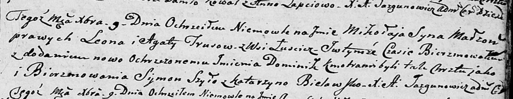

**Трус Миколай Леонов (Trus Mikołay Dominik)**

9 декабря 1804 г -- крещение (НИАБ 136-13-894, лист 56, №58/1804-р
(ориг)).

**НИАБ 136-13-894:** Лист 56. **Метрическая запись №58/1804-р (ориг).**

{width="6.496527777777778in"
height="1.2545155293088364in"}

Дедиловичская Покровская церковь. 9 декабря 1804 года. Метрическая
запись о крещении.

Trus Mikolay Dominik -- сын родителей с деревни Лустичи.

Trus Leon -- отец.

Trusowa Agata -- мать.

Szyło Symon -- кум.

Bielawska Katarzyna -- кума.

Jazgunowicz Antoni -- ксёндз.
