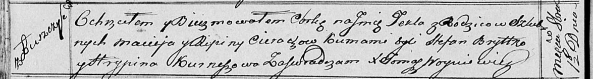

**Церах Рипина (Cierachowa Ripina)**

1 октября 1816 г -- крещение дочери Текли (НИАБ 136-13-894, лист 94об,
№35/1816-р (ориг)).

**НИАБ 136-13-894:** Лист 94об. **Метрическая запись №35/1816-р
(ориг).**

Осовская Покровская церковь. 1 октября 1816 года. Метрическая запись о
крещении.

Cierachowna Tekla -- дочь родителей с деревни Лустичи.

Cierach Maciey -- отец.

Cierachowa Ripina -- мать.

Brytko Stefan -- кум.

Kurneszowa Hrypina -- кума.

Woyniewicz Tomasz -- ксёндз.
