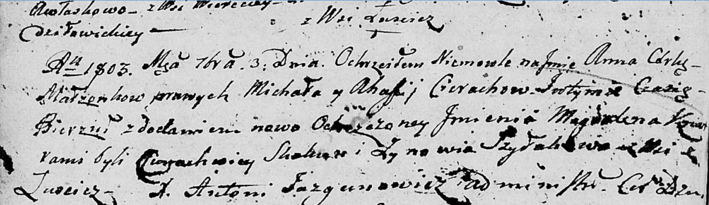

**Церах Анна Михалова (Cierachowna Anna Magdalena)**

3 сентября 1803 г -- крещение (НИАБ 136-13-894, лист 51об, №35/1803-р
(ориг)).

**НИАБ 136-13-894:** Лист 51об. **Метрическая запись №35/1803-р
(ориг).**

Дедиловичская Покровская церковь. 3 сентября 1803 года. Метрическая
запись о крещении.

Cierachowna Anna Magdalena -- дочь родителей с деревни Лустичи.

Cierach Michał -- отец.

Cierachowa Ahafija -- мать.

Skakun Cimachwiey -- кум.

Szyłakowa Zynowija -- кума.

Jazgunowicz Antoni -- ксёндз.
