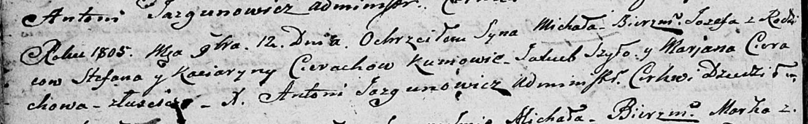

**Церах Стефан (Cierach Stefan)**

12 ноября 1805 г -- крещение сына Михала Иосифа (НИАБ 136-13-894, лист
58, №51/1805-р (ориг)).

**НИАБ 136-13-894:** Лист 58. **Метрическая запись №51/1805-р (ориг).**

{width="6.496527777777778in"
height="1.006428258967629in"}

Дедиловичская Покровская церковь. 12 ноября 1805 года. Метрическая
запись о крещении.

Cierach Michal Jozef -- сын родителей с деревни Лустичи.

Cierach Stefan -- отец.

Cierachowa Kaciaryna -- мать.

Szyło Jakub -- кум.

Cierachowa Marjana -- кума.

Jazgunowicz Antoni -- ксёндз.
