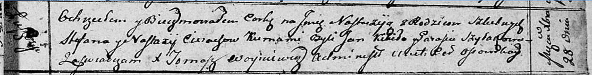

**Церах Настасья (Cierachowa Nastazija)**

28 декабря 1812 г -- крещение дочери Настасьи (НИАБ 136-13-894, лист 86,
№63/1812-р (ориг)).

**НИАБ 136-13-894:** Лист 86. **Метрическая запись №63/1812-р (ориг).**

Осовская Покровская церковь. 28 декабря 1812 года. Метрическая запись о
крещении.

Cierachowna Nastazija -- дочь родителей с деревни Лустичи.

Cierach Stefan -- отец.

Cierachowa Nastazija -- мать.

Kikiło Jan -- кум.

Szyłakowa Parasia -- кума.

Woyniewicz Tomasz -- ксёндз.
