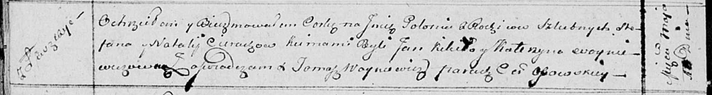

**Церах Полония Стефанова (Cierachowna Połonija)**

10 мая 1814 г -- крещение (НИАБ 136-13-894, лист 89об, №29/1814-р
(ориг)).

**НИАБ 136-13-894:** Лист 89об. **Метрическая запись №29/1814-р
(ориг).**

Осовская Покровская церковь. 10 мая 1814 года. Метрическая запись о
крещении.

Cierachowna Połonija -- дочь родителей с деревни Лустичи.

Cierach Stefan -- отец.

Cierachowa Natalija -- мать.

Kikiło Jan -- кум.

Woyniewiczowna Katerzyna -- кума.

Woyniewicz Tomasz -- ксёндз.
