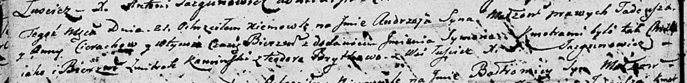

**Церах Андрей Тадеев (Cierach Andrzey Symon)**

21 августа 1804 г -- крещение (НИАБ 136-13-894, лист 54об, №32/1804-р
(ориг)).

**НИАБ 136-13-894:** Лист 54об. **Метрическая запись №32/1804-р
(ориг).**

Дедиловичская Покровская церковь. 21 августа 1804 года. Метрическая
запись о крещении.

Cierach Andrzey Symon -- сын родителей с деревни Лустичи.

Cierach Tadeusz -- отец.

Cierachowa Anna -- мать.

Kaminski Zmitrok -- кум.

Brytkowa Teodora -- кума.

Jazgunowicz Antoni -- ксёндз.
