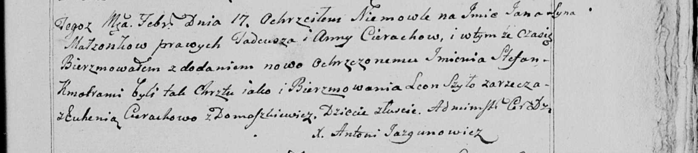

**Церах Анна (Cierachowa Anna)**

17 февраля 1799 г -- крещение сына Яна Стефана (НИАБ 136-13-894, лист
38об, №11/1799-р (ориг)), (РГИА 823-2-18, лист 268об, №11/1799-р (коп),
НИАБ 136-13-938, лист 241, №11/1799-р (коп)).

11 сентября 1799 г -- крестная мать Анны, дочери Скакунов Антона и
Катерыны с деревни Домашковичи (НИАБ 136-13-938, лист 244, №34/1796-р
(коп)).

21 августа 1804 г -- крещение сына Андрея Сымона (НИАБ 136-13-894, лист
54об, №32/1804-р (ориг)).

**НИАБ 136-13-894:** Лист 38об. **Метрическая запись №11/1799-р
(ориг).**

{width="6.496527777777778in"
height="1.33832895888014in"}

Дедиловичская Покровская церковь. 17 февраля 1799 года. Метрическая
запись о крещении.

Cierach Jan Stefan -- сын родителей с деревни Лустичи.

Cierach Thadeusz -- отец.

Cierachowa Anna -- мать.

Szyło Leon-- кум.

Cierachowa Euhenija -- кума.

Jazgunowicz Antoni -- ксёндз.

**РГИА 823-2-18:** Лист 268об. **Метрическая запись №11/1799-р (коп).**

{width="6.496527777777778in"
height="1.3569444444444445in"}

Дедиловичская Покровская церковь. 17 февраля 1799 года. Метрическая
запись о крещении.

Cierech Jan -- сын родителей с деревни Лустичи.

Cierech Tadeusz -- отец.

Cierachowa Anna -- мать.

Szyło Leon -- кум, с деревни Лустичи.

Cierachowa Euhenija -- кума, с деревни Лустичи.

Jazgunowicz Antoni -- ксёндз.

**НИАБ 136-13-938:** Лист 241. **Метрическая запись №11/1799-р (коп).**

(См. тж. НИАБ 136-13-894, лист 38об, №11/1799-р (ориг); РГИА 823-2-18,
лист 268об, №11/1799-р (коп))

{width="6.496527777777778in"
height="1.425in"}

Дедиловичская Покровская церковь. 17 февраля 1799 года. Метрическая
запись о крещении.

Cierach Jan Stefan -- сын родителей с деревни Лустичи.

Cierach Tadeusz -- отец.

Cierachowa Anna -- мать.

Szyło Leon -- кум, с деревни Заречье.

Cierachowa Euhenia - кума, с деревни Домашковичи.

Jazgunowicz Antoni -- ксёндз.

**НИАБ 136-13-938:** Лист 244. **Метрическая запись №34/1799-р (коп).**

(См. тж. НИАБ 136-13-894, лист 39об, №36/1799-р (ориг); РГИА 823-2-18,
лист 271, №33/1799-р (коп))

{width="6.496527777777778in"
height="1.886111111111111in"}

Дедиловичская Покровская церковь. 11 сентября 1799 года. Метрическая
запись о крещении.

Skakunowna Anna Marcella -- дочь родителей с деревни \[Домашковичи\].

Skakun Antoni -- отец.

Skakunowa Katerzyna -- мать.

Cierach Charyton -- кум, с деревни Лустичи.

Cierachowna Anna - кума, с деревни Лустичи.

Jazgunowicz Antoni -- ксёндз.

**НИАБ 136-13-894:** Лист 54об. **Метрическая запись №32/1804-р
(ориг).**

{width="6.496527777777778in"
height="0.7952198162729659in"}

Дедиловичская Покровская церковь. 21 августа 1804 года. Метрическая
запись о крещении.

Cierach Andrzey Symon -- сын родителей с деревни Лустичи.

Cierach Tadeusz -- отец.

Cierachowa Anna -- мать.

Kaminski Zmitrok -- кум.

Brytkowa Teodora -- кума.

Jazgunowicz Antoni -- ксёндз.
