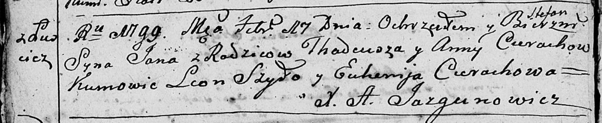
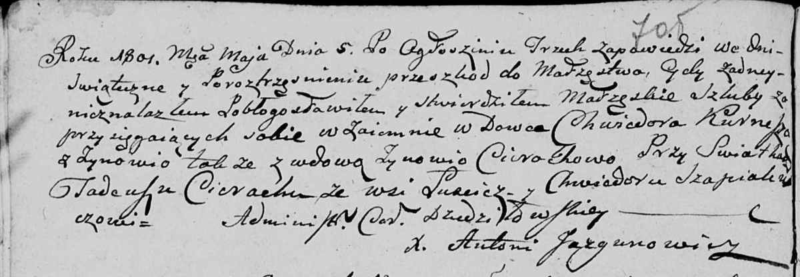
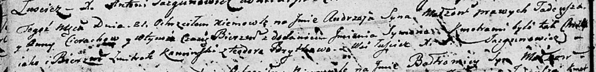

**Церах Тадей (Cierach Thadeusz, Tadeusz)**

17 февраля 1799 г -- крещение сына Яна Стефана (НИАБ 136-13-894, лист
38об, №11/1799-р (ориг)), (РГИА 823-2-18, лист 268об, №11/1799-р (коп),
НИАБ 136-13-938, лист 241, №11/1799-р (коп)).

5 мая 1801 г -- свидетель венчания вдовца Хведора Курнеша на вдове
Зыновии Церах (НИАБ 136-13-920, лист 7об, №3/1801-б (ориг)).

21 августа 1804 г -- крещение сына Андрея Сымона (НИАБ 136-13-894, лист
54об, №32/1804-р (ориг)).

**НИАБ 136-13-894:** Лист 38об. **Метрическая запись №11/1799-р
(ориг).**

Дедиловичская Покровская церковь. 17 февраля 1799 года. Метрическая
запись о крещении.

Cierach Jan Stefan -- сын родителей с деревни Лустичи.

Cierach Thadeusz -- отец.

Cierachowa Anna -- мать.

Szyło Leon-- кум.

Cierachowa Euhenija -- кума.

Jazgunowicz Antoni -- ксёндз.

**РГИА 823-2-18:** Лист 268об. **Метрическая запись №11/1799-р (коп).**

Дедиловичская Покровская церковь. 17 февраля 1799 года. Метрическая
запись о крещении.

Cierech Jan -- сын родителей с деревни Лустичи.

Cierech Tadeusz -- отец.

Cierachowa Anna -- мать.

Szyło Leon -- кум, с деревни Лустичи.

Cierachowa Euhenija -- кума, с деревни Лустичи.

Jazgunowicz Antoni -- ксёндз.

**НИАБ 136-13-938:** Лист 241. **Метрическая запись №11/1799-р (коп).**

(См. тж. НИАБ 136-13-894, лист 38об, №11/1799-р (ориг); РГИА 823-2-18,
лист 268об, №11/1799-р (коп))

Дедиловичская Покровская церковь. 17 февраля 1799 года. Метрическая
запись о крещении.

Cierach Jan Stefan -- сын родителей с деревни Лустичи.

Cierach Tadeusz -- отец.

Cierachowa Anna -- мать.

Szyło Leon -- кум, с деревни Заречье.

Cierachowa Euhenia - кума, с деревни Домашковичи.

Jazgunowicz Antoni -- ксёндз.

**НИАБ 136-13-920:** Лист 7об. **Метрическая запись №3/1801-б (ориг).**

Дедиловичская Покровская церковь. 5 мая 1801 года. Метрическая запись о
венчании.

Kurnesz Chwiedor -- жених, вдовец.

Cierachowa Zynowia -- невеста, вдова.

Cierach Tadeusz -- свидетель, деревня Лустичи.

Szapialewicz Chwiedor -- свидетель.

Jazgunowicz Antoni -- ксёндз.

**НИАБ 136-13-894:** Лист 54об. **Метрическая запись №32/1804-р
(ориг).**

Дедиловичская Покровская церковь. 21 августа 1804 года. Метрическая
запись о крещении.

Cierach Andrzey Symon -- сын родителей с деревни Лустичи.

Cierach Tadeusz -- отец.

Cierachowa Anna -- мать.

Kaminski Zmitrok -- кум.

Brytkowa Teodora -- кума.

Jazgunowicz Antoni -- ксёндз.
