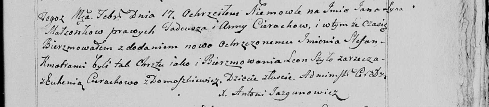

**Церах Ян Тадеев (Cierach Jan Stefan)**

17 февраля 1799 г -- крещение (НИАБ 136-13-894, лист 38об, №11/1799-р
(ориг)), (РГИА 823-2-18, лист 268об, №11/1799-р (коп), НИАБ 136-13-938,
лист 241, №11/1799-р (коп)).

**НИАБ 136-13-894:** Лист 38об. **Метрическая запись №11/1799-р
(ориг).**

Дедиловичская Покровская церковь. 17 февраля 1799 года. Метрическая
запись о крещении.

Cierach Jan Stefan -- сын родителей с деревни Лустичи.

Cierach Thadeusz -- отец.

Cierachowa Anna -- мать.

Szyło Leon-- кум.

Cierachowa Euhenija -- кума.

Jazgunowicz Antoni -- ксёндз.

**РГИА 823-2-18:** Лист 268об. **Метрическая запись №11/1799-р (коп).**

Дедиловичская Покровская церковь. 17 февраля 1799 года. Метрическая
запись о крещении.

Cierech Jan -- сын родителей с деревни Лустичи.

Cierech Tadeusz -- отец.

Cierachowa Anna -- мать.

Szyło Leon -- кум, с деревни Лустичи.

Cierachowa Euhenija -- кума, с деревни Лустичи.

Jazgunowicz Antoni -- ксёндз.

**НИАБ 136-13-938:** Лист 241. **Метрическая запись №11/1799-р (коп).**

(См. тж. НИАБ 136-13-894, лист 38об, №11/1799-р (ориг); РГИА 823-2-18,
лист 268об, №11/1799-р (коп))

Дедиловичская Покровская церковь. 17 февраля 1799 года. Метрическая
запись о крещении.

Cierach Jan Stefan -- сын родителей с деревни Лустичи.

Cierach Tadeusz -- отец.

Cierachowa Anna -- мать.

Szyło Leon -- кум, с деревни Заречье.

Cierachowa Euhenia - кума, с деревни Домашковичи.

Jazgunowicz Antoni -- ксёндз.
