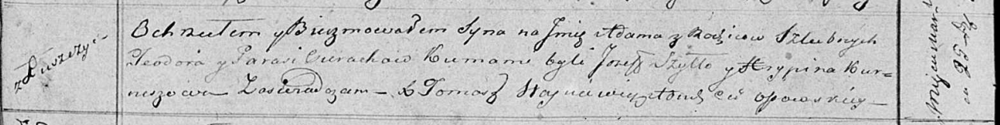

**Церах Адам Тодоров (Cierach Adam)**

22 марта 1819 г -- крещение (НИАБ 136-13-894, лист 100об, №14/1819-р
(ориг)).

**НИАБ 136-13-894:** Лист 100об. **Метрическая запись №14/1819-р
(ориг).**

Осовская Покровская церковь. 22 марта 1819 года. Метрическая запись о
крещении.

Cierach Adam -- сын родителей с деревни Лустичи.

Cierach Teodor -- отец.

Cierachowa Parasia -- мать.

Szyło Jozef -- кум.

Kurneszowa Hrypina -- кума.

Woyniewicz Tomasz -- ксёндз.
