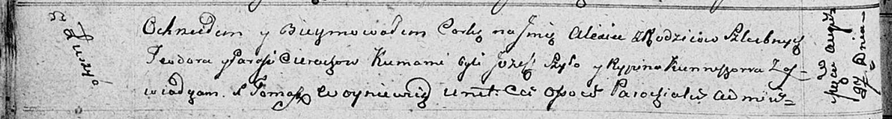

**Церах Алеся Тодорова (Cierachowna Alesia)**

27 августа 1811 г -- крещение (НИАБ 136-13-894, лист 81об, №44/1811-р
(ориг)).

**НИАБ 136-13-894:** Лист 81об. **Метрическая запись №44/1811-р
(ориг).**

Осовская Покровская церковь. 27 августа 1811 года. Метрическая запись о
крещении.

Cierachowna Alesia -- дочь родителей с деревни Лустичи.

Cierach Teodor -- отец.

Cierachowa Parasia -- мать.

Szyło Jozef -- кум.

Kurneszowa Rypina -- кума.

Woyniewicz Tomasz -- ксёндз.
