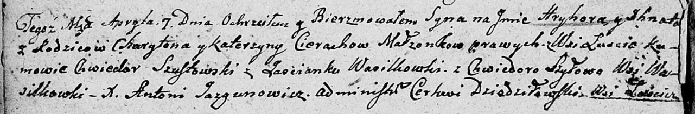

**Церах Грыгор Харытонов (Cierach Hryhor Ihnat)**

7 апреля 1807 г -- крещение сына Грыгора Игната (НИАБ 136-13-894, лист
62об, №21/1807-р (ориг)).

**НИАБ 136-13-894:** Лист 62об. **Метрическая запись №21/1807-р
(ориг).**

Дедиловичская Покровская церковь. 7 апреля 1807 года. Метрическая запись
о крещении.

Cierach Hryhor Jhnat -- сын родителей с деревни Лустичи.

Cierach Charyton -- отец.

Cierachowa Katerzyna -- мать.

Szustowski Chwiedor -- кум, с застенока Васильковка.

Szyłowa Chwiedora -- кума, с деревни Васильковка.

Jazgunowicz Antoni -- ксёндз.
