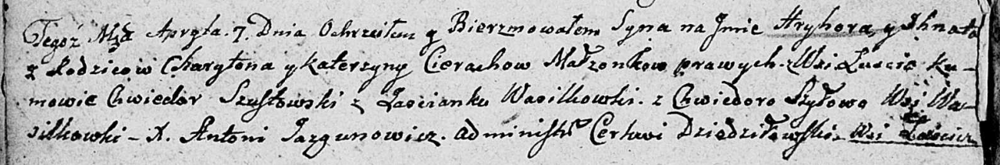

**Церах Катерына (Cierachowa, Czerechowa Katerzyna)**

4 марта 1789 г -- крещение сын Бенедыкта (НИАБ 136-13-894, лист 6об,
№12/1789-р (ориг)).

16 января 1793 г -- крещение дочери Варвары (НИАБ 136-13-894, лист 18об,
№13/1789-р (ориг)).

1 июля 1795 г -- крещение сына Яна (НИАБ 136-13-894, лист 24об,
№18/1795-р (ориг)), (РГИА 823-2-18, лист 252об, №15/1795-р (коп)).

25 апреля 1798 г -- крещение сына Марка (НИАБ 136-13-894, лист 36,
№17/1798-р (ориг)), (РГИА 823-2-18, лист 263, №17/1798-р (коп)).

31 января 1801 г -- крещение сына Франциска (НИАБ 937-4-32, лист 4,
№4/1800-р).

1 апреля 1800 г -- крестная мать Евы Дороты, дочери Церахов Степана и
Евгении с деревни Домашковичи (НИАБ 136-13-894, лист 41, №12/1800-р
(ориг), НИАБ 136-13-949, лист 102, №12/1800-р (коп)).

7 апреля 1807 г -- крещение сына Грыгора Игната (НИАБ 136-13-894, лист
62об, №21/1807-р (ориг)).

30 июля 1810 г -- крещение сына Каетана (НИАБ 136-13-894, лист 78,
№32/1810-р (ориг)).

**НИАБ 136-13-894:** Лист 6об. **Метрическая запись №12/1789-р (ориг).**

Дедиловичская Покровская церковь. 4 марта 1789 года. Метрическая запись
о крещении.

Cierach Benedykt -- сын родителей с деревни Лустичи.

Cierach Charyton -- отец.

Cierachowa Katerzyna -- мать.

Szustowski Chwiedor - кум.

Szyłanka Chwiedora - кума.

Jazgunowicz Antoni -- ксёндз.

**НИАБ 136-13-894:** Лист 18-об. **Метрическая запись №13/1793-р
(ориг).**

Дедиловичская Покровская церковь. 16 января 1793 года. Метрическая
запись о крещении.

Cierachowna Barbara -- дочь родителей с деревни Лустичи.

Cierach Haryton -- отец.

Cierachowa Katerzyna -- мать.

Szustowski Chwiedor - кум.

Szyłowa Chwiedora - кума.

Jazgunowicz Antoni -- ксёндз.

**НИАБ 136-13-894:** Лист 24-об. **Метрическая запись №18/1795-р
(ориг).**

Дедиловичская Покровская церковь. 1 июля 1795 года. Метрическая запись о
крещении.

Cierach Jan -- сын родителей с деревни Лустичи.

Cierach Haryton -- отец.

Cierachowa Katerzyna -- мать.

Susztowski Chwiedor - кум.

Szyłowa Chwiedora - кума.

Jazgunowicz Antoni -- ксёндз.

**РГИА 823-2-18:** Лист 252об. **Метрическая запись №15/1795-р (коп).**

Дедиловичская Покровская церковь. 1 июля 1795 года. Метрическая запись о
крещении.

Cierach Jan -- сын родителей с деревни Лустичи.

Cierach Charyton -- отец.

Cierachowa Katarzyna -- мать.

Szustowski Chwiedor -- кум.

Szyłowa Chwiedora -- кума.

Jazgunowicz Antoni -- ксёндз.

**НИАБ 136-13-894:** Лист 36. **Метрическая запись №17/1798-р (ориг).**

Дедиловичская Покровская церковь. 25 апреля 1798 года. Метрическая
запись о крещении.

Cierach Marko -- сын родителей с деревни Лустичи.

Cierach Charyton -- отец.

Cierachowa Katerzyna -- мать.

Susztowski Chwiedor - кум.

Szyłowa Teodora - кума.

Jazgunowicz Antoni -- ксёндз.

**РГИА 823-2-18:** Лист 263. **Метрическая запись №17/1798-р (коп).**

Дедиловичская Покровская церковь. 25 апреля 1798 года. Метрическая
запись о крещении.

Cierach Marko -- сын родителей с деревни \[Лустичи\].

Cierach Charyton -- отец.

Cierachowa Katerzyna -- мать.

Susztowski Chwiedor -- кум.

Szyłowa Theodora -- кума.

Jazgunowicz Antoni -- ксёндз.

**НИАБ 136-13-894:** Лист 41. **Метрическая запись №12/1800-р (ориг).**

Дедиловичская Покровская церковь. 1 апреля 1800 года. Метрическая запись
о крещении.

Cierachowna Ewa Dorota -- близнец, дочь родителей с деревни Домашковичи.

Cierachowna Nastazyja Anna -- близнец, дочь родителей с деревни
Домашковичи.

Cierach Stefan -- отец.

Cierachowa Euhenija -- мать.

Szyło Jakub -- кум, крестный отец Евы Дороты, с деревни Лустичи.

Cierachowa Katerzyna -- кума, крестная мать Евы Дороты, с деревни
Лустичи.

Siczko? Kondrat -- кум, крестный отец Настасьи Анны, с деревни
Домашковичи.

Cierachowa Dorota -- кума, крестная мать Настасьи Анны, с деревни Отруб.

Jazgunowicz Antoni -- ксёндз.

**НИАБ 937-4-32:** Лист 4. **Метрическая запись №4/1801-р.**

Дедиловичский костел Наисвятейшего Сердца Иисуса. 31 января 1801 года.
Метрическая запись о крещении.

Czerech Francisc -- сын крестьян с деревни Лустичи.

Czerecz Chariton -- отец.

Czerechowa Catharina -- мать.

Szustowski Chwiedor -- крестный отец, с деревни Васильковичи.

Szyłowa Chwiedora -- крестная мать, с деревни Васильковичи.

Linhart Hyacinthus -- ксёндз.

**НИАБ 136-13-949:** Лист 102. **Метрическая запись №12/1800-р (коп).**

(См. тж.: РГИА 823-2-18, лист 275, №12/1800-р (коп), НИАБ 136-13-894,
лист 41, №12/1800-р (ориг))

Дедиловичская Покровская церковь. 11 апреля 1800 года. Метрическая
запись о крещении.

Cierachowna Ewa Dorota -- дочь родителей с деревни Домашковичи.

Cierach Stefan -- отец.

Cierachowa Euhenia -- мать.

Szyło Jakub -- кум, с деревни Лустичи.

Cierachowa Katerzyna - кума, с деревни Домашковичи \[Лустичи\].

Jazgunowicz Antoni -- ксёндз.

**НИАБ 136-13-894:** Лист 62об. **Метрическая запись №21/1807-р
(ориг).**

Дедиловичская Покровская церковь. 7 апреля 1807 года. Метрическая запись
о крещении.

Cierach Hryhor Jhnat -- сын родителей с деревни Лустичи.

Cierach Charyton -- отец.

Cierachowa Katerzyna -- мать.

Szustowski Chwiedor -- кум, с застенока Васильковка.

Szyłowa Chwiedora -- кума, с деревни Васильковка.

Jazgunowicz Antoni -- ксёндз.

**НИАБ 136-13-894:** Лист 78. **Метрическая запись №32/1810-р (ориг).**

Осовская Покровская церковь. 30 июля 1810 года. Метрическая запись о
крещении.

Cierach Kajetan -- сын родителей с деревни Лустичи.

Cierach Charyton -- отец.

Cierachowa Katerzyna -- мать.

Szyłowski Teodor -- кум.

Szyłowska Chwiedora -- кума.

Woyniewicz Tomasz -- ксёндз.
