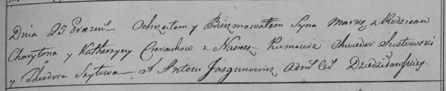

**Церах Марко Харытонов (Cierach Marko)**

25 апреля 1798 г -- крещение (НИАБ 136-13-894, лист 36, №17/1798-р
(ориг)), (РГИА 823-2-18, лист 263, №17/1798-р (коп)).

**НИАБ 136-13-894:** Лист 36. **Метрическая запись №17/1798-р (ориг).**

Дедиловичская Покровская церковь. 25 апреля 1798 года. Метрическая
запись о крещении.

Cierach Marko -- сын родителей с деревни Лустичи.

Cierach Charyton -- отец.

Cierachowa Katerzyna -- мать.

Susztowski Chwiedor - кум.

Szyłowa Teodora - кума.

Jazgunowicz Antoni -- ксёндз.

**РГИА 823-2-18:** Лист 263. **Метрическая запись №17/1798-р (коп).**

Дедиловичская Покровская церковь. 25 апреля 1798 года. Метрическая
запись о крещении.

Cierach Marko -- сын родителей с деревни \[Лустичи\].

Cierach Charyton -- отец.

Cierachowa Katerzyna -- мать.

Susztowski Chwiedor -- кум.

Szyłowa Theodora -- кума.

Jazgunowicz Antoni -- ксёндз.
