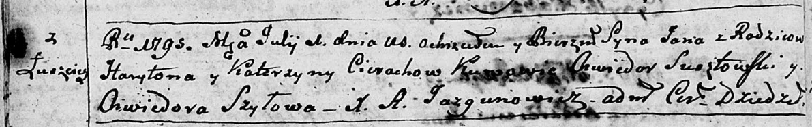
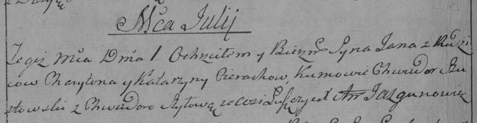

**Церах Ян Харытонов (Cierach Jan)**

1 июля 1795 г -- крещение (НИАБ 136-13-894, лист 24об, №18/1795-р
(ориг)), (РГИА 823-2-18, лист 252об, №15/1795-р (коп)).

**НИАБ 136-13-894:** Лист 24-об. **Метрическая запись №18/1795-р
(ориг).**

Дедиловичская Покровская церковь. 1 июля 1795 года. Метрическая запись о
крещении.

Cierach Jan -- сын родителей с деревни Лустичи.

Cierach Haryton -- отец.

Cierachowa Katerzyna -- мать.

Susztowski Chwiedor - кум.

Szyłowa Chwiedora - кума.

Jazgunowicz Antoni -- ксёндз.

**РГИА 823-2-18:** Лист 252об. **Метрическая запись №15/1795-р (коп).**

Дедиловичская Покровская церковь. 1 июля 1795 года. Метрическая запись о
крещении.

Cierach Jan -- сын родителей с деревни Лустичи.

Cierach Charyton -- отец.

Cierachowa Katarzyna -- мать.

Szustowski Chwiedor -- кум.

Szyłowa Chwiedora -- кума.

Jazgunowicz Antoni -- ксёндз.
