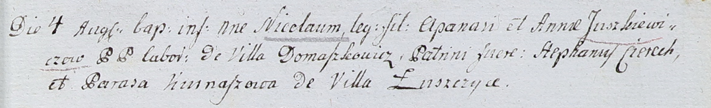

**Церах Стефан (Cierach Stephan)**

4 августа 1802 г -- крестный отец Николая, сына Апанаса и Анны Юшкевичов
(НИАБ 937-4-32, лист 7, №22/1802-р).

**НИАБ 937-4-32:** Лист 7. **Метрическая запись №22/1802-р.**

Дедиловичский костел Наисвятейшего Сердца Иисуса. 4 августа 1802 года.
Метрическая запись о крещении.

Juszkiewicz Nicołay -- сын крестьян с деревни Домашковичи.

Juszkiewicz Apanas -- отец.

Juszkiewiczowa Anna -- мать.

Cierech Stephan -- крестный отец, с деревни Лустичи.

Kurnaszowa Parasa -- крестная мать, с деревни Лустичи.

Linhart Hyacinthus -- ксёндз.
