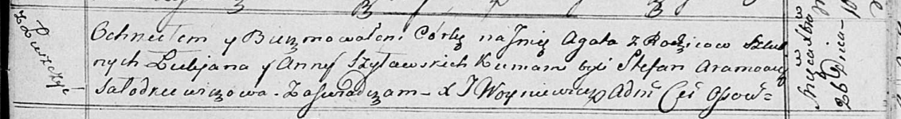

**Шиловский Лукьян (Szyłowski Łukjan)**

26 декабря 1816 г -- крещение дочери Агаты (НИАБ 136-13-894, лист 95,
№44/1816-р (ориг)).

**НИАБ 136-13-894:** Лист 95. **Метрическая запись №44/1816-р (ориг).**

Осовская униатская церковь. 26 декабря 1816 года. Метрическая запись о
крещении.

Szyłowska Agata -- дочь родителей с деревни Лустичи.

Szyłowski Łukjan -- отец.

Szyłowska Anna -- мать.

Aramowicz Stefan -- кум.

Sałodkiewiczowa -- кума.

Woyniewicz Tomasz -- ксёндз.
