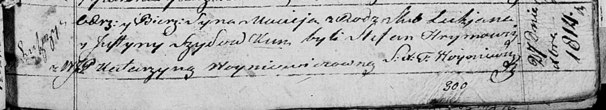

**Шиловский Лукьян (Szyłowski Łukjan)**

27 декабря 1814 г -- крещение сына Мацея (НИАБ 136-13-894, лист 91,
№72/1814-р (ориг)).

**НИАБ 136-13-894:** Лист 91. **Метрическая запись №72/1814-р (ориг).**

{width="6.496527777777778in"
height="1.1901476377952755in"}

Осовская Покровская церковь. 27 декабря 1814 года. Метрическая запись о
крещении.

Szyłowski Maciey -- сын родителей с деревни Лустичи.

Szyłowski Łukjan -- отец.

Szyłowska Justyna -- мать.

Hrymowicz Stefan -- кум.

Woyniewiczowna Katarzyna, JP -- кума, шляхтянка.

Woyniewicz Tomasz -- ксёндз.
